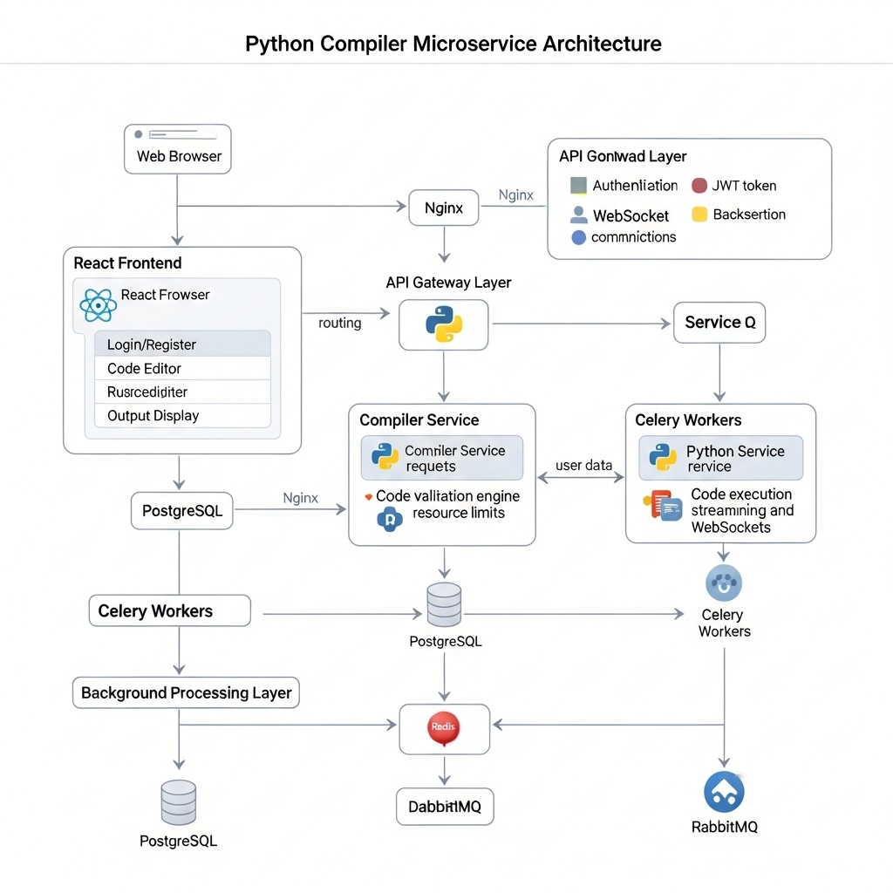

          
# Python Compiler Documentation

## Table of Contents

- [Overview](#overview)
- [Architecture](#architecture)
- [Installation](#installation)
  - [Development Setup](#development-setup)
  - [Docker Setup](#docker-setup)
- [Configuration](#configuration)
  - [Auth Service Environment Variables](#auth-service-environment-variables)
  - [Compiler Service Environment Variables](#compiler-service-environment-variables)
- [Features](#features)
  - [User Authentication](#user-authentication)
  - [Code Execution](#code-execution)
  - [Interactive Input](#interactive-input)
- [API Reference](#api-reference)
  - [Authentication API](#authentication-api)
  - [Compiler API](#compiler-api)
  - [WebSocket API](#websocket-api)
- [Frontend Guide](#frontend-guide)
- [Security Considerations](#security-considerations)
- [Troubleshooting](#troubleshooting)
- [Contributing](#contributing)
- [License](#license)

## Overview

The Python Compiler is a web-based application that allows users to write, execute, and interact with Python code in real-time. It provides a secure environment for code execution with resource limits, user authentication, and interactive input capabilities.

## Architecture

The application follows a microservices architecture with the following components:

1. **Auth Service**: Handles user registration, authentication, and JWT token management
2. **Compiler Service**: Manages code execution in a secure environment
3. **Frontend**: React-based user interface for code editing and execution
4. **Nginx**: Reverse proxy that routes requests to appropriate services

Additional infrastructure components:
- **PostgreSQL**: Database for user information
- **Redis**: Cache for code output streaming and WebSocket communication
- **RabbitMQ**: Message broker for asynchronous code execution tasks



## Installation

### Development Setup

1. Clone the repository:

```bash
git clone https://github.com/Amirreza-Jabbari/python-compiler.git
cd python-compiler
```

2. Set up the Auth Service:

```bash
cd auth_service
python -m venv venv
.\venv\Scripts\activate
pip install -r requirements.txt
python manage.py migrate
python manage.py runserver 8001
```

3. Set up the Compiler Service:

```bash
cd ../compiler_service
python -m venv venv
.\venv\Scripts\activate
pip install -r requirements.txt
python manage.py migrate
```

4. Start the Compiler Service components:

```bash
# Terminal 1: Start the web server
python manage.py runserver 8002

# Terminal 2: Start the Celery worker
celery -A compiler_service worker --loglevel=info
```

5. Set up the Frontend:

```bash
cd ../compiler-frontend
npm install
npm run dev
```

### Docker Setup

For a production-ready setup, use Docker Compose:

```bash
docker-compose up -d
```

This will start all services, including PostgreSQL, Redis, and RabbitMQ. The application will be available at http://localhost:80.

## Configuration

### Auth Service Environment Variables

Create a `.env` file in the `auth_service` directory with the following variables:

```
DJANGO_SECRET_KEY=your-secret-key
DJANGO_DEBUG=False
POSTGRES_DB=auth_db
POSTGRES_USER=postgres
POSTGRES_PASSWORD=yourpassword
POSTGRES_HOST=postgres
POSTGRES_PORT=5432
ALLOWED_HOSTS=localhost,auth_service,nginx
CORS_ALLOWED_ORIGINS=http://localhost,http://frontend,http://nginx
```

### Compiler Service Environment Variables

Create a `.env` file in the `compiler_service` directory with the following variables:

```
DJANGO_SECRET_KEY=your-secret-key
DJANGO_DEBUG=False
ALLOWED_HOSTS=localhost,compiler_service_web,nginx
CORS_ALLOWED_ORIGINS=http://localhost,http://frontend,http://nginx
REDIS_HOST=redis
REDIS_PORT=6379
RABBITMQ_HOST=rabbitmq
RABBITMQ_PORT=5672
CODE_EXECUTION_MAX_TIME=5
CODE_EXECUTION_MAX_MEMORY=100
```

## Features

### User Authentication

The application provides user registration and authentication using JWT tokens. Features include:

- User registration with email, username, and password
- Secure login with JWT token generation
- Token refresh for extended sessions
- Password validation and security

### Code Execution

Users can execute Python code with the following features:

- Syntax validation before execution
- Asynchronous code execution using Celery
- Resource limits (CPU time and memory)
- Real-time output streaming via WebSockets
- Security measures to prevent dangerous code execution

### Interactive Input

The application supports interactive Python programs that require user input:

- Code can use the `input()` function to request user input
- Input prompts are displayed to the user in real-time
- Users can submit input through the UI
- Input is processed by the running code and output is streamed back

## API Reference

### Authentication API

#### Register User

```
POST /api/users/register/
```

Request body:
```json
{
  "username": "example_user",
  "password": "secure_password",
  "password2": "secure_password",
  "email": "user@example.com",
  "first_name": "John",
  "last_name": "Doe"
}
```

Response:
```json
{
  "username": "example_user",
  "email": "user@example.com",
  "first_name": "John",
  "last_name": "Doe"
}
```

#### Login

```
POST /api/users/login/
```

Request body:
```json
{
  "username": "example_user",
  "password": "secure_password"
}
```

Response:
```json
{
  "refresh": "refresh_token",
  "access": "access_token"
}
```

#### Refresh Token

```
POST /api/users/token/refresh/
```

Request body:
```json
{
  "refresh": "refresh_token"
}
```

Response:
```json
{
  "access": "new_access_token"
}
```

### Compiler API

#### Execute Code

```
POST /api/compiler/execute/
```

Headers:
```
Authorization: Bearer access_token
```

Request body:
```json
{
  "code": "name = input('Enter name: ') print('Hi,', name)"
}
```

Response:
```json
{
  "message": "Code execution started",
  "id": "execution_id",
  "session_id": "session_uuid"
}
```

### WebSocket API

Connect to the WebSocket endpoint:

```
ws://localhost/ws/compiler/
```

Or for secure connections:

```
wss://localhost/ws/compiler/
```

#### Set Session

After connecting, set the session ID:

```json
{
  "action": "set_session",
  "session_id": "session_uuid"
}
```

#### Get Prompt

Check for input prompts:

```json
{
  "action": "get_prompt"
}
```

Response (if a prompt exists):

```json
{
  "prompt": "Enter name: "
}
```

#### Submit User Input

Send input to the running code:

```json
{
  "action": "user_input",
  "input": "John Doe"
}
```

#### Receive Output

Output is streamed automatically:

```json
{
  "output": "Hi, John Doe!\n"
}
```

## Frontend Guide

The frontend is built with React and Material-UI, providing a clean and responsive interface for code execution.

Key components:

- **Login/Register**: User authentication forms
- **CodeExecutor**: Main component for code editing and execution
  - Code editor with syntax highlighting
  - Execute button to run code
  - Output display area
  - Interactive input form when prompted

The frontend communicates with the backend through:
- REST API calls for authentication and code execution requests
- WebSocket connections for real-time output streaming and interactive input

## Security Considerations

### Code Execution Security

The application implements several security measures for safe code execution:

1. **Input Validation**: Python code is validated for syntax errors and dangerous imports
2. **Resource Limits**: CPU time and memory usage are restricted
3. **Sandboxing**: Code execution is isolated from the host system
4. **Dangerous Import Prevention**: Potentially harmful modules like `os`, `subprocess`, etc. are blocked

### Authentication Security

1. **JWT Tokens**: Secure authentication using JWT with limited lifetimes
2. **Password Validation**: Enforces password strength requirements
3. **HTTPS Support**: Configuration for secure communication

### Network Security

1. **CORS Restrictions**: Configurable CORS settings to limit cross-origin requests
2. **Nginx Proxy**: Proper request routing and header management
3. **WebSocket Security**: Support for secure WebSocket connections (WSS)

## Troubleshooting

### Common Issues

1. **WebSocket Connection Failures**
   - Check if the WebSocket server is running
   - Verify that Nginx is properly configured for WebSocket proxying
   - Ensure the correct WebSocket URL is being used (ws:// or wss://)

2. **Code Execution Timeouts**
   - Check if the code contains infinite loops
   - Verify that the `CODE_EXECUTION_MAX_TIME` setting is appropriate
   - Check Celery worker logs for errors

3. **Database Connection Issues**
   - Verify PostgreSQL credentials in the `.env` file
   - Check if the PostgreSQL service is running
   - Ensure the database has been migrated

### Logs

Check the following logs for troubleshooting:

- Django logs: `auth_service/logs` and `compiler_service/logs`
- Nginx logs: `/var/log/nginx/error.log` and `/var/log/nginx/access.log`
- Docker logs: `docker-compose logs [service_name]`

## Contributing

Contributions to the Python Compiler project are welcome! Here's how to get started:

1. Fork the repository
2. Create a feature branch: `git checkout -b feature/your-feature-name`
3. Make your changes
4. Run tests to ensure everything works
5. Commit your changes: `git commit -m "Add some feature"`
6. Push to the branch: `git push origin feature/your-feature-name`
7. Create a pull request

### Development Guidelines

- Follow PEP 8 style guide for Python code
- Write unit tests for new features
- Update documentation when adding or changing functionality
- Use meaningful commit messages

## License

This project is licensed under the MIT License. See the [LICENSE](LICENSE) file for details.

---

© 2025 Python Compiler Microservice Project. All rights reserved.